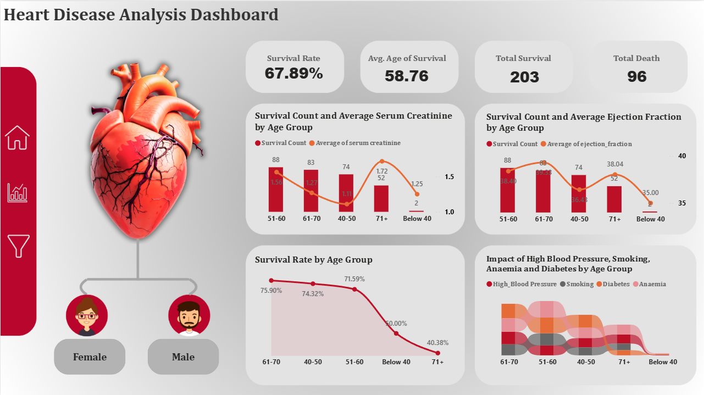

# 🚀 Heart Disease Analysis Dashboard in Power BI  

## 📌 Project Overview
The purpose of this project is to demonstrate how to create a **dynamic Heart Disease Analysis Dashboard** in **Power BI**.  
This dashboard provides key health insights, helping to analyze survival patterns, age-related risk factors, and the impact of clinical indicators.  

## 📊 Key Features of the Dashboard  

### 🔑 KPI Overview
- **Survival Rate (%)**
- **Average Age of Survivors**
- **Total Survival Count**
- **Total Death Count**

### 📈 Visual Insights
1. **Survival Count & Average Serum Creatinine by Age Group**  
   Helps identify how survival varies with age and how creatinine levels correlate with outcomes.

2. **Survival Count & Average Ejection Fraction by Age Group**  
   Visualizes heart function among survivors, highlighting how performance changes with age.

3. **Survival Rate by Age Group (Line Chart)**  
   Shows survival trends across age groups to detect age-related risk patterns.

4. **Ribbon Chart – Risk Factors**  
   Displays the impact of **Smoking, High Blood Pressure, Diabetes, and Anaemia** across different age groups.

### 🎛 Interactive Features
- **Slicer by Sex** → Enables gender-based filtering of the analysis.  

## 📝 Steps Covered in the Project
1. **Data Ingestion** (Excel dataset imported into Power BI)  
2. **KPI Creation** (DAX measures for survival & mortality insights)  
3. **Chart Development** (Bar, Line, Ribbon, KPI cards)  
4. **Professional Dashboard Layout** (Interactive & user-friendly design)  

## 📂 Files in this Repository
- **Heart Disease Analysis.pbix** → Power BI Dashboard file  
- **Heart_Disease_Dataset.xlsx** → Dataset used for analysis  
- **1.png** → Dashboard screenshot  
- **README.md** → Documentation  

## ⚡ Tech Stack
- **Power BI** → Dashboard creation & visualization  
- **DAX** → Measure calculations  
- **Excel** → Source dataset  

## 📢 Insights & Findings
- Patients with **higher serum creatinine** and **lower ejection fraction** show higher mortality risk.  
- **Survival rate decreases with age**, especially in elderly groups.  
- Risk factors like **high blood pressure & diabetes** contribute significantly across age categories.  

## 📌 Author
👩 Sneha Ghosh  
📧 [[LinkedIn ID](https://www.linkedin.com/in/sneha-ghosh-98aaa9337)]  
